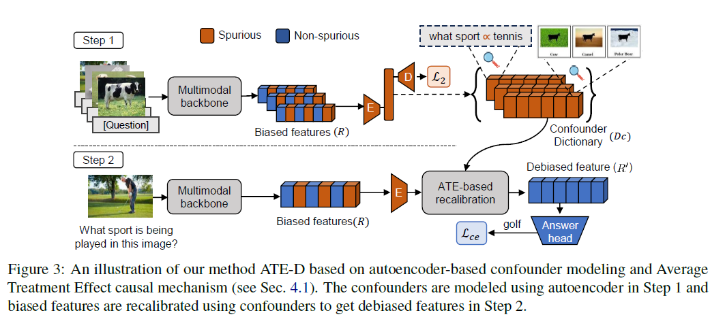
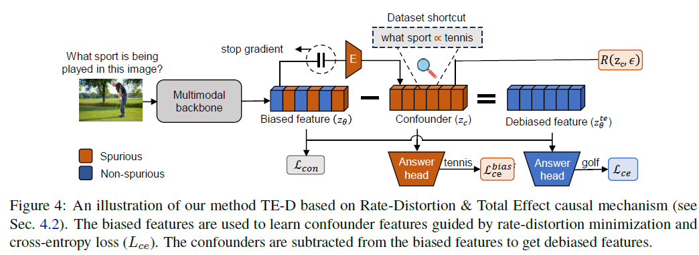

# Debiasing Multimodal Models via Causal Information Minimization

This repository includes PyTorch code for the EMNLP 2023 (Findings) paper:

[Debiasing Multimodal Models via Causal Information Minimization]()

* Authors: [Vaidehi Patil](https://vaidehi99.github.io/), [Adyasha Maharana](https://adymaharana.github.io/) and [Mohit Bansal](https://www.cs.unc.edu/~mbansal/)
* Paper: [arXiv]()




### Setup

1. Create a virtual environment and activate it.
```
python3 -m venv env
source env/bin/activate
```
2. Install dependencies
```
python -m pip install -r requirements.txt
```

### TE-D
```
cd LXMERT-TED
PYTHONPATH=$PYTHONPATH:./src \
python -u src/tasks/vqa.py --train train --valid val  --llayers 9 --xlayers 5 --rlayers 5 --batchSize 32 --optim bert --lr 5e-5 --epochs 50 \
--tqdm --name vqa-cp-test --output /nas-hdd/tarbucket/adyasha/models/vqa-cp/vqa-cp-causal-0.25-contrastive-no-norm-finetuned-lr-5e-5-seed-${SEED}/ \
--seed ${SEED} --loss-fn Farm --use-farm --farm-coeff 0.25 --gpu 1 --causal-model --dynamic-coeff --wandb --contrastive \
--load ./output/pretrained/vqa-cp_lxrt_pretrained.pth
```

### ATE-D
```
cd LXMERT-VQACP
PYTHONPATH=$PYTHONPATH:./src python -u src/tasks/vqa.py --train train --valid val  --llayers 9 --xlayers 5 --rlayers 5 --loadLXMERTQA snap/pretrained/model --batchSize 32 --optim bert --lr 5e-5 --epochs 4 --tqdm
```
### Reference
Please cite our paper if you find our work useful:

@misc{patil2023debiasing,
      title={Debiasing Multimodal Models via Causal Information Minimization}, 
      author={Vaidehi Patil and Adyasha Maharana and Mohit Bansal},
      year={2023},
      eprint={2311.xxxxx},
      archivePrefix={arXiv},
      primaryClass={cs.CL}
}
